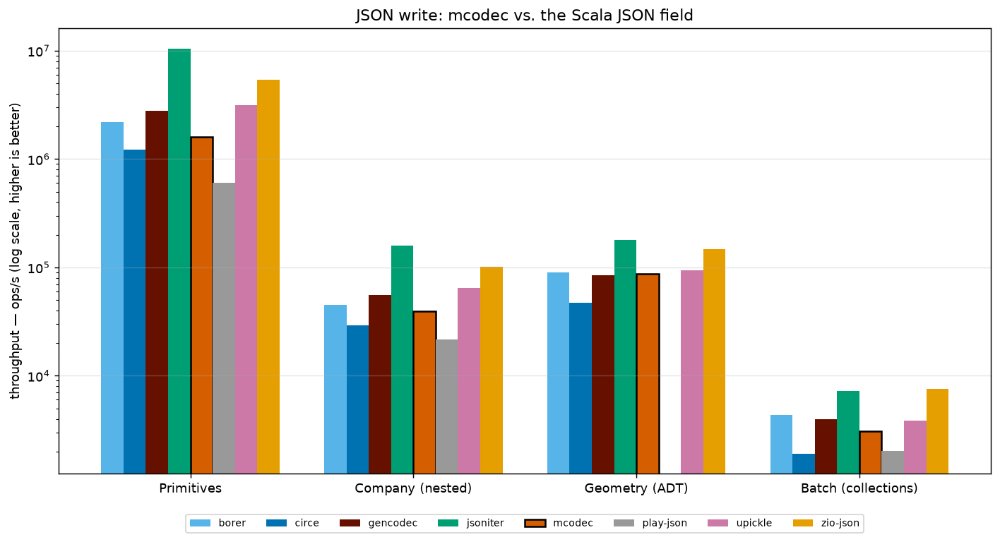
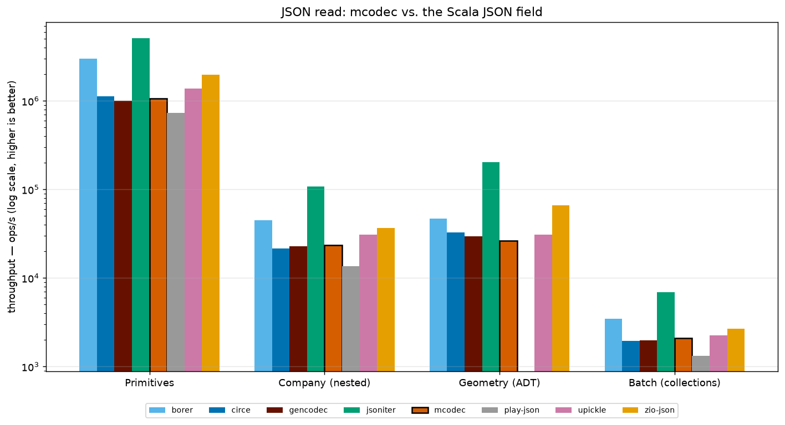
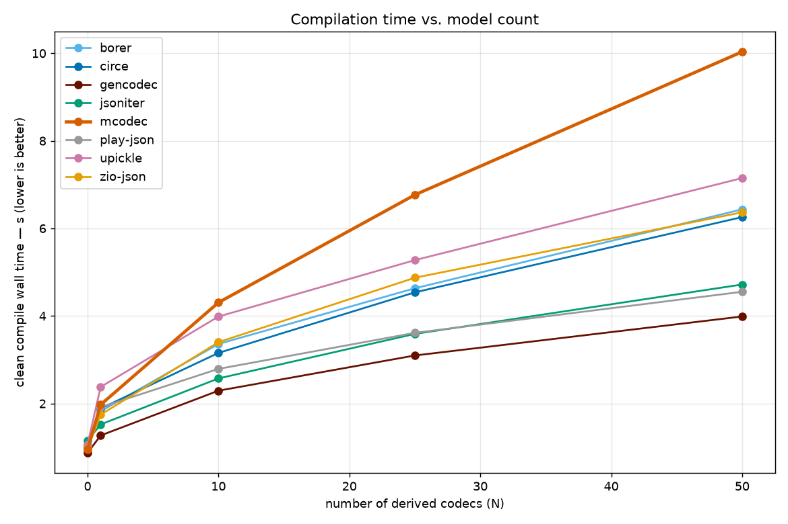
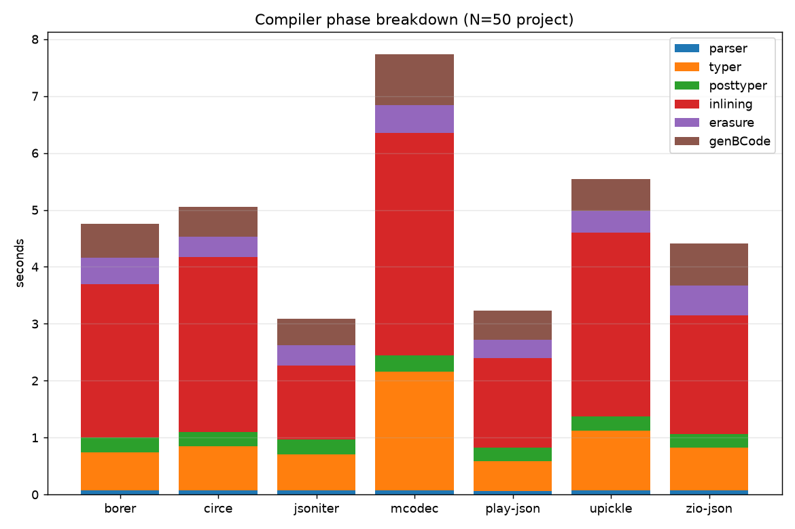

# mcodec benchmarks

How mcodec compares to popular Scala 3 JSON libraries on the two axes that matter for a derivation-based codec: **how
long it takes the compiler** to derive codecs, and **how fast those codecs run**.

> Numbers below are regenerated by `benchmark/scripts/run_all.sh`. They are
> single-machine measurements — treat them as *indicative*, not authoritative.
> The environment for the committed run is under [Environment](#environment).

## Takeaways

- **vs. GenCodec (the design mcodec copies): even on reads, ~40 % behind on writes.** `read` throughput is within noise
  of GenCodec on every model (Primitives 1.06M vs 1.00M, Company 23k vs 23k, Batch 2.1k vs 2.0k). `write` is the gap —
  GenCodec does 2.78M / 55k / 4.0k where mcodec does 1.61M / 39k / 3.1k — *except* the recursive ADT, where mcodec's 87k
  edges GenCodec's 84k.
- **Runtime vs. the Scala 3 field: mid-pack.** On writes mcodec tracks borer and beats circe and play-json across every
  model; on reads it sits with circe / uPickle and behind zio-json. jsoniter-scala is 3–6× everyone else (its own
  league).
- **mcodec's ADT write is a relative strength** — 87k ops/s on the recursive Geometry model, behind only jsoniter and
  ahead of circe (47k), borer and zio-json.
- **Compile time is the weak spot.** The `transparent inline` derivation is the
  steepest-scaling in the group — ~10 s for 50 + 12 codecs vs. ~4–6 s for the
  Scala 3 macro libraries and **~4 s for GenCodec's Scala 2 macro** (≈2.5× mcodec's
  own ancestor). It also emits ~3.5× more bytecode than circe or jsoniter. The
  cost is concentrated in the **typer** and **inlining** phases.

## Libraries under test

| library                         | version   | derivation                                | notes                                                             |
|---------------------------------|-----------|-------------------------------------------|-------------------------------------------------------------------|
| **mcodec**                      | this tree | `MCodec.derived` (Made mirrors + inline)  | JSON backend, `String` I/O                                        |
| circe + circe-generic           | 0.14.16   | `deriveCodec` (semi-auto, Shapeless-3)    | ecosystem default                                                 |
| jsoniter-scala                  | 2.40.1    | `JsonCodecMaker.make` (macro)             | byte-native; performance reference                                |
| uPickle                         | 4.4.3     | `macroRW`                                 | single `ReadWriter`, closest API analogue                         |
| zio-json                        | 1.0.0     | `DeriveJsonCodec.gen` (macro)             |                                                                   |
| borer                           | 1.18.0    | `deriveCodec` / `deriveAllCodecs` (macro) | byte-native; streaming design like mcodec                         |
| play-json                       | 2.10.8    | `Json.format` (macro)                     | products only — no Scala 3 sealed-hierarchy macro                 |
| **GenCodec** (AVSystem commons) | 2.29.0    | `GenCodec.materialize` (macro)            | **the design mcodec copies.** Scala 2.13 only — runtime rows only |

## Scenarios

Four models, each stressing a different part of a codec — see
[`benchmark/src/models/Models.scala`](../benchmark/src/models/Models.scala):

| model                   | shape                                                       | stresses                                               |
|-------------------------|-------------------------------------------------------------|--------------------------------------------------------|
| **Primitives**          | flat 12-field record                                        | number formatting/parsing, `Option`, field dispatch    |
| **Company (nested)**    | 5 types, 3 levels, ~40 employees, `BigDecimal`              | recursion, object framing                              |
| **Geometry (ADT)**      | GeoJSON-flavoured sealed hierarchy, 7 cases, self-recursive | discriminator write + lookup                           |
| **Batch (collections)** | 500 events, `Vector` / `Map` / `Set` / `List`               | collection builders, map keys, large payload (~150 KB) |

## Serialization / deserialization

Throughput of `value → String` (`write`) and `String → value` (`read`), measured with JMH, `Mode.Throughput`. The
suite's annotations request `@Fork(3)`, 5×1s warmup, 10×1s measurement; the **committed run** used `-f 2 -wi 3 -i 5` on
a laptop — enough to rank the libraries, not a substitute for a full run on a dedicated box.

Every library is measured on the **same `A ↔ String` substrate**. jsoniter-scala and borer are byte-native and pay a
UTF-8 conversion here that they would not pay against `Array[Byte]` — so their `String` numbers understate their native
path.

Each library reads back **its own** output — wire shapes differ between libraries (nested-discriminator vs. `"type"`
field, etc.) and that is expected; the benchmark measures each library's own round trip, not cross-compatibility.

**GenCodec** runs from a separate Scala 2.13 build ([`benchmark/gencodec/`](../benchmark/gencodec/)) — same models,
payloads and JMH settings, through `JsonStringOutput` / `JsonStringInput`. Same JVM, so throughput is directly
comparable.

<!-- BENCH:serde-write START -->
_Throughput, ops/s (higher is better) — `write`._

| library | Primitives | Company (nested) | Geometry (ADT) | Batch (collections) |
| --- | --- | --- | --- | --- |
| borer | 2,192,367 | 45,141 | 90,174 | 4,330 |
| circe | 1,224,572 | 29,119 | 47,222 | 1,917 |
| gencodec | 2,782,406 | 55,282 | 84,053 | 3,967 |
| jsoniter | 10,491,500 | 159,731 | 179,076 | 7,284 |
| mcodec | 1,611,691 | 39,435 | 87,277 | 3,091 |
| play-json | 602,348 | 21,764 | n/a | 2,013 |
| upickle | 3,123,448 | 64,275 | 94,457 | 3,851 |
| zio-json | 5,405,113 | 100,908 | 147,986 | 7,520 |
<!-- BENCH:serde-write END -->

<!-- BENCH:serde-read START -->
_Throughput, ops/s (higher is better) — `read`._

| library | Primitives | Company (nested) | Geometry (ADT) | Batch (collections) |
| --- | --- | --- | --- | --- |
| borer | 3,010,364 | 45,066 | 46,510 | 3,485 |
| circe | 1,121,404 | 21,536 | 32,573 | 1,960 |
| gencodec | 997,703 | 22,808 | 29,345 | 1,967 |
| jsoniter | 5,123,041 | 107,622 | 202,482 | 6,867 |
| mcodec | 1,063,834 | 23,444 | 26,402 | 2,099 |
| play-json | 735,036 | 13,593 | n/a | 1,329 |
| upickle | 1,372,504 | 30,710 | 31,041 | 2,255 |
| zio-json | 1,984,531 | 36,909 | 66,179 | 2,672 |
<!-- BENCH:serde-read END -->




## Compilation time

For each library, a **clean** compile (`scala-cli compile --server=false`, no
Bloop, no incremental compiler) of a generated project containing `N` derived
codecs: `N` independent case classes of 8–14 fields plus `N/4` sealed hierarchies
of 6 cases each. `run_all.sh full` sweeps `N ∈ {0, 1, 10, 25, 50, 100}`; the
committed run goes to 50, 2 runs each, mean reported. (Nesting depth is a runtime
concern, covered by the Company model above; this sweep isolates how compile time
scales with the *number* of derived codecs.)

The `N=0` row is the fixed cost (JVM + scalac startup + dependency classpath); the **slope** from `N=1` upward is the
derivation cost. Generator and driver:
[`benchmark/compile/`](../benchmark/compile/).

GenCodec is included here as a **cross-ecosystem** reference — it is compiled by Scala 2.13, so it is not a
like-for-like measurement against the Scala 3 compiler, but it does answer "is mcodec's Scala 3 `inline` derivation
cheaper or dearer than the Scala 2 macro it replaces?". Scala 2.13 has no built-in
`-Yprofile-trace`, so GenCodec has no phase-breakdown row.

<!-- BENCH:compile START -->
_Clean compile wall time, seconds (lower is better); last column is total emitted `.class` bytes. N = derived codecs._

| library | N=0 | N=1 | N=10 | N=25 | N=50 | bytecode @ N=50 |
| --- | --- | --- | --- | --- | --- | --- |
| borer | 1.0 | 1.8 | 3.4 | 4.6 | 6.4 | 1,701 KB |
| circe | 1.0 | 1.9 | 3.2 | 4.5 | 6.3 | 1,231 KB |
| gencodec ¹ | 0.9 | 1.3 | 2.3 | 3.1 | 4.0 | 1,531 KB |
| jsoniter | 1.2 | 1.5 | 2.6 | 3.6 | 4.7 | 1,306 KB |
| mcodec | 0.9 | 2.0 | 4.3 | 6.8 | 10.0 | 4,448 KB |
| play-json | 1.0 | 1.9 | 2.8 | 3.6 | 4.6 | 1,220 KB |
| upickle | 1.1 | 2.4 | 4.0 | 5.3 | 7.1 | 2,269 KB |
| zio-json | 1.0 | 1.7 | 3.4 | 4.9 | 6.4 | 2,595 KB |

¹ GenCodec is compiled by **Scala 2.13.18**, not the Scala 3 compiler — a cross-ecosystem data point, not a like-for-like measurement.

### Compiler phase breakdown

_Seconds per scalac phase for the N=50 project. Macro / mirror derivation and `inline` expansion land in **typer** and **inlining** — their sum is the derivation cost._

| library | parser | typer | posttyper | inlining | erasure | genBCode | typer+inlining |
| --- | --- | --- | --- | --- | --- | --- | --- |
| borer | 0.07 | 0.67 | 0.26 | 2.69 | 0.47 | 0.59 | **3.36** |
| circe | 0.07 | 0.78 | 0.25 | 3.08 | 0.35 | 0.52 | **3.86** |
| jsoniter | 0.08 | 0.64 | 0.26 | 1.30 | 0.36 | 0.47 | **1.93** |
| mcodec | 0.07 | 2.09 | 0.29 | 3.90 | 0.49 | 0.89 | **5.99** |
| play-json | 0.07 | 0.52 | 0.24 | 1.57 | 0.33 | 0.52 | **2.09** |
| upickle | 0.07 | 1.05 | 0.25 | 3.22 | 0.39 | 0.56 | **4.27** |
| zio-json | 0.07 | 0.75 | 0.24 | 2.09 | 0.52 | 0.74 | **2.84** |
<!-- BENCH:compile END -->




## Caveats

- **Single machine, single JDK.** Absolute numbers do not transfer between machines; the *ratios* between libraries are
  the portable part.
- **`String` substrate.** mcodec's public API (`Json.read` / `Json.write`) is
  `String`-only, so the whole matrix uses `String`. This understates the byte-native libraries (jsoniter-scala, borer),
  which are built for
  `Array[Byte]` and pay a UTF-8 conversion here.
- **Scala 3.9.0 (Scala Next).** mcodec pins 3.9.0 via Made 0.4.1. Every competitor is published for 3.3 LTS and consumed
  here via TASTy forward-compatibility; a native 3.9.0 build of each might differ slightly.
- **Default configuration.** Each library uses its out-of-the-box derivation with no hand-tuning (no jsoniter
  `CodecMakerConfig` beyond recursion, no circe
  `Configuration`, etc.). A tuned setup can move the numbers.
- **play-json** covers only the three product models — its Scala 3 `Json.format`
  macro does not derive sealed hierarchies.
- **GenCodec is Scala 2.13** — a different compiler and standard library. Same-JVM runtime throughput is a fair
  comparison; its compile-time row is a cross-ecosystem reference (Scala 2 macro vs. Scala 3 `inline`), flagged as such
  and not stacked in the phase chart.
- **JIT warm-up** is handled by JMH forking + warmup iterations; the compile sweep deliberately does the opposite (cold
  JVM every run).

## Environment

Committed run:

```
date:      2026-09-02
cpu:       Apple M4 Pro
ram:       48 GB
os:        macOS 26.6.1 (25G76)
jdk:       OpenJDK 26.0.1 (Homebrew)
scala:     3.9.0
scala-cli: 1.15.0
jmh:       1.37   (-f 2 -wi 3 -i 5)
```

A laptop under normal desktop load — fine for ranking, not for absolute numbers. Re-run
`benchmark/scripts/run_all.sh full` on a quiet dedicated machine for a citable dataset.

## Reproducing

```sh
# everything (~1h): JMH matrix + compile sweep + report + charts
benchmark/scripts/run_all.sh full

# quick sanity pass: 1 fork, fewer sizes (a few minutes)
benchmark/scripts/run_all.sh quick

# just one slice
scala-cli --power run benchmark --exclude gencodec --jmh -- 'CompanyBench.*' -p lib=mcodec,circe
scala-cli --power run benchmark/gencodec --jmh -- 'CompanyBench.*'   # GenCodec (Scala 2.13)
python3 benchmark/compile/bench_compile.py --libs mcodec,circe --sizes 0,25,50
```
